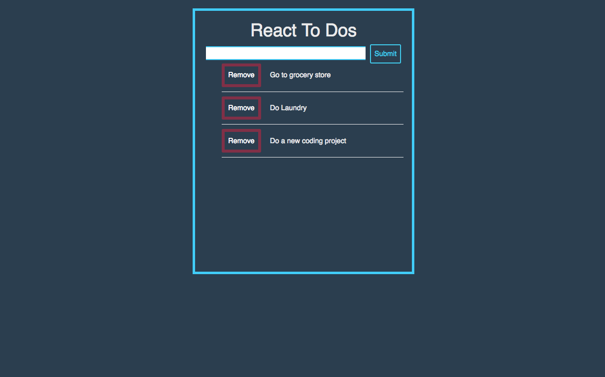
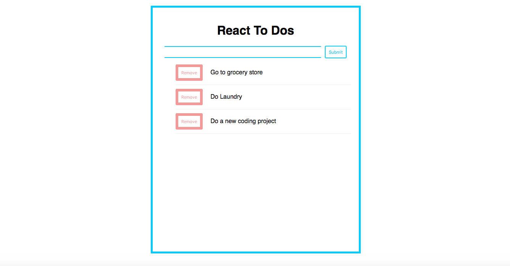

## React To Do List

## Functionality and Scope of Projet

Users can add to the list and delete items from it. Aimed to create an app to refresh on my React skills and make it look visually appealing.

## Technologies Used

- React
- Javascript
- Node
- Express
- Github

## Screen Shot

## Updated View

## Next Steps

I will continue to work this to bring additional functionality. I intend on building out multiple lists for users to use because let's be honest, who has just one to do list? I am inspired by Trello and their design. I hope to build something similar to it.
